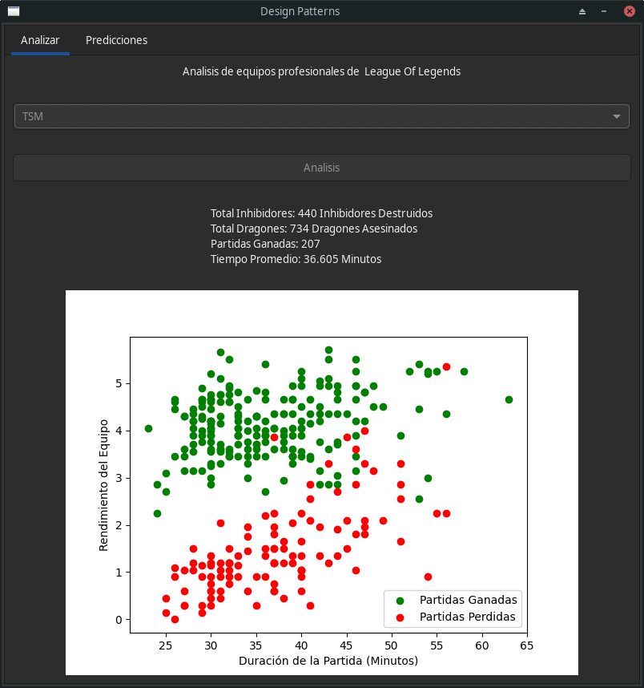
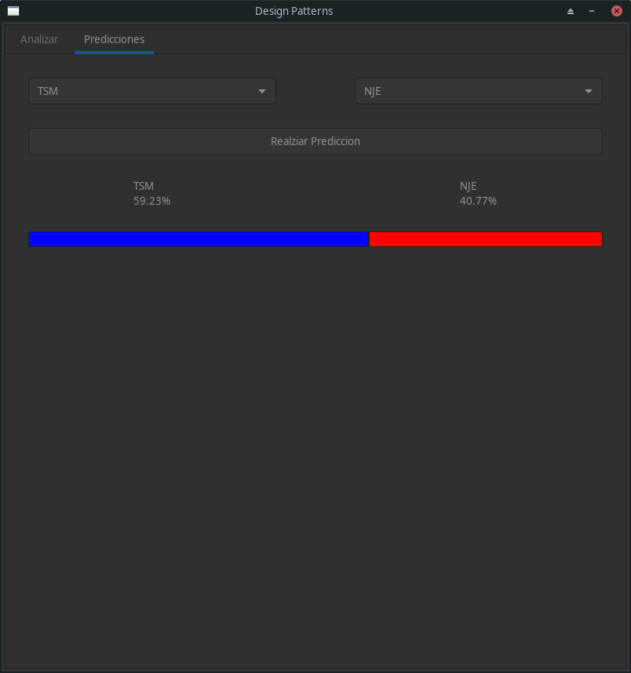
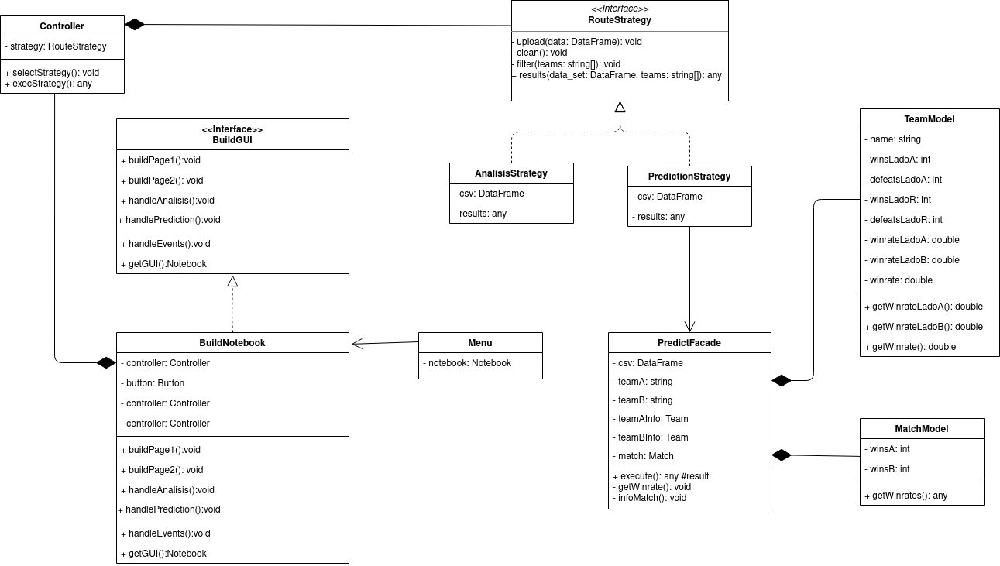

<h1 style='text-align:center'> Recap Design Patterns </h1>

Programa para analizar un csv mediante la aplicación de patrones de diseño

## Integrantes
- Jesús Manuel Leiva Bermúdez - 20191020132
- Jesus Alberto Lozada Montiel - 20191020098
- Sergio David Paez Suarez - 20191020167

## Vistas de la aplicación






## Ejecución en modo desarrollo

Las aplicaciones en Python usualmente hacen uso de paquetes y módulos que no forman parte de la librería estándar, esto significa que tal vez no sea posible para una instalación de Python para ejecutar la aplicación.

La solución a este problema es crear un entorno virtual, un directorio que contiene una instalación de Python de una versión en particular, además de unos cuantos paquetes adicionales.

```console
python3 -m venv .env
```

Una vez creado el entorno virtual, para ejecutarlo

En Windows, ejecuta:

```console
.env\Scripts\activate.bat
```

En distribuciones linux o MacOS, ejecuta:
```console
source .env/bin/activate
```

Finalmente instalar las dependencias especificadas en `requirements.txt`

```console
pip install -r requirements.txt
```

## Patrones de diseño

Aplicamos 3 patrones de diseño: Builder, Strategy y Facade.

-**Builder**:     Separa la construcción de un objeto complejo de su representación, de forma que el mismo proceso de construcción pueda crear diferentes representaciones.

-**Strategy**:Define una familia de algoritmos, encapsula uno de ellos y los hace intercambiables. Permite que un algoritmo varíe independientemente de los clientes que lo usan.

-**Facade**:Proporciona una interfaz unificada para un conjunto de interfaces de un subsistema. Define una interfaz de alto nivel que hace que el subsistema se más fácil de usar.


## Diagrama de clases



